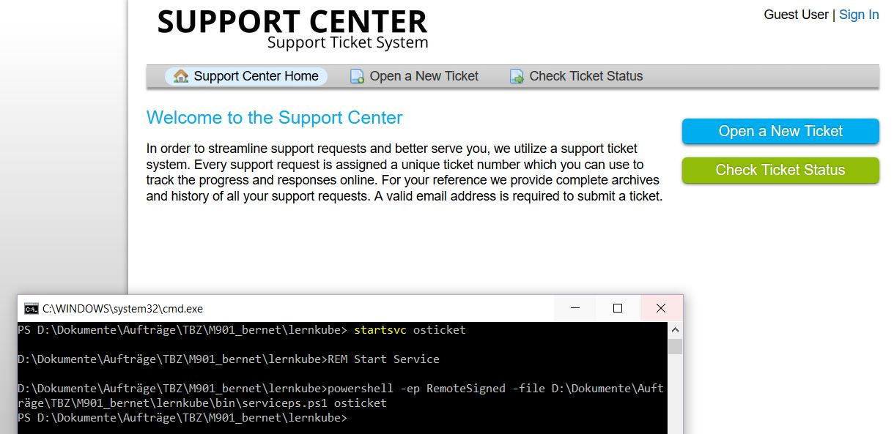

# myE701 - Exam 701: DevOps Tools Engineer   

Beispiel für einen Aufbau einer Dokumention des Lern- und Entwicklungsprozesses mit Ausgesuchten Unterkapiteln aus dem LPI E701 Exam

## Fahrplan
***

| Datum | behandelte Unterrichtsinhalte: | Gewichtung |
| -------- | ------ | -------- |
| 15.05.19 | Installation SW, Einrichten Linux VM(s)  [701.3 Source Code Management](https://github.com/nalmik/myE701#7013-source-code-management-status-in-arbeit)  | 5 |
| 22.05.19 | [701.1 Modern Software Development](https://github.com/nalmik/myE701#7013-source-code-management-status-in-arbeit) | 6 |
| 29.05.19 | [702.2 Container Deployment and Orchestration](https://github.com/nalmik/myE701#7013-source-code-management-status-in-arbeit) | 5 | 
| 05.06.19 | [703.1 Virtual Machine Deployment](https://github.com/nalmik/myE701#7013-source-code-management-status-in-arbeit)  | 8 | 
| 12.06.19 | [703.2 Cloud Deployment](https://github.com/nalmik/myE701#7013-source-code-management-status-in-arbeit) | 2 |
| 19.06.19 | [702.3 Container Infrastructure](https://github.com/nalmik/myE701#7013-source-code-management-status-in-arbeit) | 4 |
| 26.06.19 | LB1 Theoretische Prüfung und Abschluss LB2 | - |
| 03.07.19 | Lehrerkonevent | - |
| 10.07.19 | Sommersporttage | - |
|          | Total Punkte | 30

Kapitel aus E701 wurden in der Gruppe mit .... erarbeitet. Davon sind mindestens 14 Punkte selbständig erarbeitet worden. 

# Dokumention des Lern- und Entwicklungsprozesses

## 701.3 Source Code Management (Status: In Arbeit)

**Weight**: 5

**Beschreibung und Ziel**  
Candidates should be able to use Git to manage and share source code. This includes creating and contributing to a repository as well as the usage of tags, branches and remote repositories. Furthermore, the candidate should be able to merge files and resolve merging conflicts.

**Beispiele und Arbeitsergebnisse**  
Das Resultat kann man beim Schluss dieses Moduls erkennen, da ich laufend mit git arbeiten werde. Folgende Theorie Punkte werde ich genauer anschauen:

Remote Repos

Branches  
Wenn man vom einer Hauptversion etwas testen will, kann man ein Branch machen. Das heisst es wird eine Kopie zusagen erstellt, bei dem man alles bearbeiten kann ohne dabei das Original zu verändern.

Tags  
Tags werden benutzt um wichtige Punkte zu markieren (z.B. die Version eines Files). Es wird dabei unter zwei Typen unterschieden: lightweight und unnotated. 
Um die von git verfügbaren tag aufzulisten, kann man folgenden Befehl eingeben:

    git tag

File Branch/Merge  
Wenn man ein Dokument oder Code auf Git bearbeiten möchte, aber dabei die Hauptdatei nicht überschreiben will macht man ein Branch (man nennt das Forken). Somit hat man wie eine Kopie vom Originalen und kann da soviel testen wie man will.  
Wenn man nun den Branch mit dem Hauptfile (master) vereinen will, heisst dies ein Merge machen.

SVN und CVS  

Zentrale und verteilte SCM Lösungen  

**Fazit und Aussicht**  
Im M300 haben wir schon etwas mit git gearbeitet, doch jetzt konnte ich das ganze Thema mehr vertieft anschauen und besser verstehen.

 

## Kapitel: 701.1 Modern Software Development (Status: In Arbeit)

**Weight**: 6

**Beschreibung und Ziel** 

API 
API steht für Application Programmung Interface und besteht aus verschiedenen Tools. Das Ziel ist dabei eine Kommunikation zwischen Servicen oder Produkte zu ermöglichen unabhängig wie sie implentiert wurde.

Microservices 
Microservices sind von der Unix Welt, mit dem Gedanken das viele kleine Programme zusammenarbeiten können. Ein Program sollte nur für eine Aufgabe zugewiesen werden, die sie gut durchführen soll.

**Unterlagen**

* Microservices YouTube Einführung 

* [API](https://www.redhat.com/de/topics/api/what-are-application-programming-interfaces)

---

**Beispiele und Arbeitsergebnisse** 
Das Praxis Beispiel von Kapitel 702.2 wäre auch ein passendes Beispiel zu diesem Kapitel.

**Fazit und Aussicht**, Ich lernte nun endlich was genau ein API ist und wie Microservices genutz werden.

 

## Kapitel: 702.2 Container Deployment and Orchestration (Status: In Arbeit)

**Weight**: 5

**Beschreibung und Ziel**  
 Kubernetes 
 Kubernetes (auch K8s genannt) ist eine open-source Plattform. Damit kann man ein Cluster, welches mehrere Linux Container beinhaltet, managen oder auch eine Automatisierung zur bereitstellung  von Container Anwendungen und Skalierung davon ermöglicht.  
K8s braucht ein OS auf dem es laufen kann und erhält von User Befehle, diese kommen zum Node der entscheidet welchen Pod den Befehl ausführen soll. Der Node gibt den Pods auch entsprechend Ressourcen. 

In K8s gibt es sogenannte Pods, dort sind Container-Anwendungen gruppiert. Die sind z.B. alle mit der gleichen IP ansprechbar. 

 

**Beispiele und Arbeitsergebnisse** 
Ich entscheide mich für die Übung osTicket für die Container Anwendung, da ich die Anwendung kenne und auch in ein anderen Modul aufsetzen musste. osTicket ist eine Plattform, welches man als Ticketing System benutzen kann.

Vom Modul hier stand uns ein lernkube zur Verfügung, welche ich hier in auch benutzt habe.   [Zur Lernkube Installation](https://github.com/w901-fr19-mi/myE701#installation-kapitel-kann-in-der-kopie-gel%C3%B6scht-werden) 

In der git bash macht man zuerst ein "vagrant up". Dies dauert jedoch ein Weilchen. Damit wird die VM master-01 erstellt.

Beim lerncube Ordner gibt es ein batch File namens kubeps.bat das man starten kann. Wenn das erfolgreich durchgelaufen ist, kann man im offenen cmd folgende zwei Befehle eingeben: 
kubectl create -f ./duk/osticket/osticket.yaml 
kubectl create -f ./duk/osticket/mysql.yaml

Damit werden die Service osTicket und Mysql, da osTicket ja auch eine Datenbank benötigt, erstellt. Mit dem Befehl: "startsvc osticket" kann der Service dann gestartet werden.

**Fazit und Aussicht**
Ich hatte zuerst Probleme gehabt um herauszufinden, was ich als erstes machen muss, doch dann wenn ich reinkam ging das aufsetzen vom Dienst um einiges schneller als mit der klassischen Variante.

**Unterlagen** 
* https://github.com/mc-b/M300/tree/master/40-Kubernetes#inhaltsverzeichnis
* https://www.redhat.com/de/topics/containers/what-is-kubernetes#
  
 

## Kapitel: 703.1 Virtual Machine Deployment (Status: In Arbeit)

**Weight**: 4

**Beschreibung und Ziel** 
Ziel ist es zu wissen wie man das Aufsetzen Virtuelle Maschinen automatisieren kann mithilfe von configuration files. 
  

**Vorgehen** 
Eine schnelle und saubere Variante ist Vagrant zu benutzen. Dafür benötigt man folgende Software: VirtualBox, Vagrant und git.
Wenn man alles installiert hat, kann man entweder selber ein Vagrantfile erstellen oder ein schon vorgefertigtes nehmen. In dem Vagrantfile sind alle nötigen informationen der VM. Wenn man ein "Vagrant up" macht nimmt es die Info vom Vagrantfile und erstellt die VM. Durch "Vagrant destroy -f" kann man es wieder vernichten. Natürlich gibt es noch viel mehr Befehle auf Vagrant doch die werde ich nicht jede einzeln aufführen.

 

**Beispiele und Arbeitsergebnisse** 
Unter diesem Link befindet sich ein von mir erstelltes Vagrantfile, welches eine VM mit Samba aufsetzten soll (leider funktioniert der Zugriff zum Share dort nicht ganz)
https://github.com/nalmik/M300/blob/master/files/Vagrantfile

**Fazit und Aussicht** 
Ich konnte mein Wissen von M300 wieder auffrischen und repetierte welche Schritte man nochmals ausführen muss bei Vagrant. 

 

## Kapitel: 703.2 Cloud Deployment (Status: In Arbeit)

**Weight**: 2

**Beschreibung und Ziel**  

**Vorgehen** 

 

**Beispiele und Arbeitsergebnisse**
| Linux          | Container      | Beschreibung      |
| -------------- | -------------- | ----------------- |
|    |   | 

**Fazit und Aussicht**, z.B. Die Durcharbeitung von ... gab mir ein besseres Verständnis über die Funktionsweise von Containern.

 

## Kapitel: 702.3 Container Infrastructure (Status: In Arbeit)

**Weight**: 4

**Beschreibung**
* Flocker und flannel kennen
* Service discovery Konzept verstehen
* Grundwissen von CoreOS Container Linux, rkt und etcd
* Sicherheitsrisiken von container Virtualisierung  und images verstehen und wie man sie migriert
  
 

**Beispiele und Arbeitsergebnisse**

| Linux          | Container      | Beschreibung      |
| -------------- | -------------- | ----------------- |
|    |   | 

**Fazit und Aussicht**, z.B. Die Durcharbeitung von ... gab mir ein besseres Verständnis über die Funktionsweise von Containern.

## Links

* [Exam 701: DevOps Tools Engineer](https://www.lpi.org/our-certifications/exam-701-objectives) 
* [E701 Dokumentation](https://github.com/w901-fr19-mi/E701)
* [myE701 Original Repository](https://github.com/w901-fr19-mi/myE701) 

**Weitere nützliche Programme**

* [Windows SSH Client, putty](https://putty.org)
* [Grafischer Windows SFTP Client, Bitvise SSH Client](https://www.bitvise.com/ssh-client-download)
* [Visual Studio Code](https://code.visualstudio.com/)
